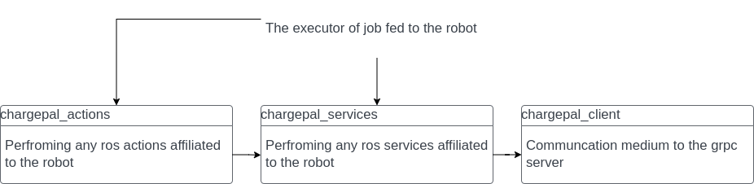
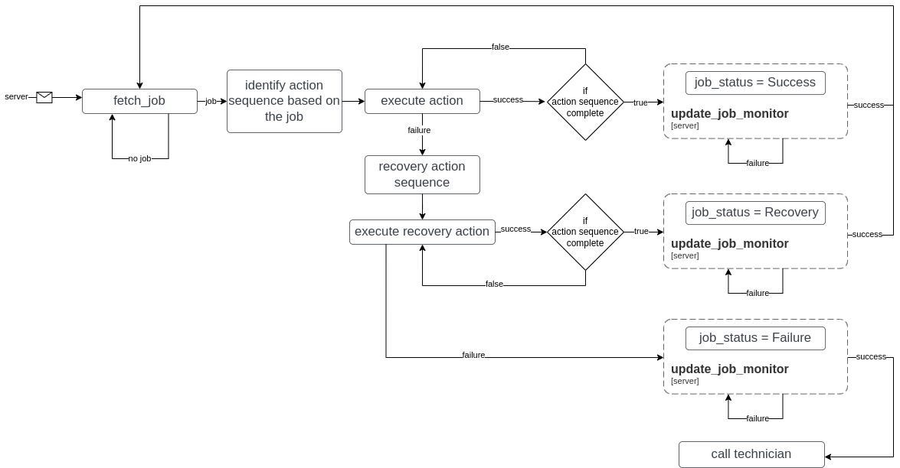
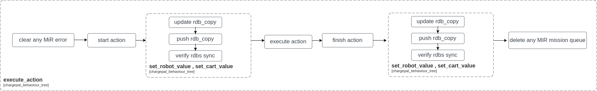

# chargepal_behaviour_tree
This package is the executor of chargepal jobs.

## Dependencies

- chargepal_actions : Performing any ros actions affiliated to the robot
- chargepal_services : Performing any ros services affiliated to the robot
- chargepal_client : Communcation medium to the grpc server

The image below shows the dependencies as a flow state

## Overview
The executor asks the server for a job every 1 second. The job description, the sequence of actions for every job type and the sequence of actions for every failed action is shown in this [document](/ChargepalActions.pdf). The behaviour tree is created to mimic the conditions and sequences represent in this [document](/ChargepalActions.pdf).

The figure below shows the executor logic within the behaviour tree.

Before performing any action within a job, the robot database and local database(server) is updated with [robot_info](/ChargepalActions.pdf) and [cart_info](/ChargepalActions.pdf). The robot database and local database(server) is also updated when the action is finished(success or failure). MiR errors and mission queues are cleared to make sure the actions based out of MiR platform are handled properly before a new action is started. 

The figure below represents the states when an action is to be performed. 

. 
