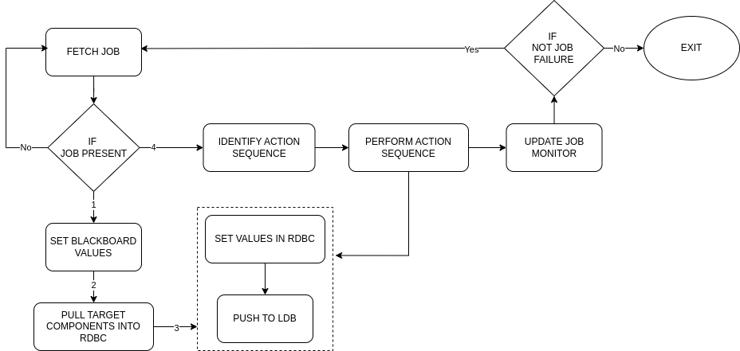
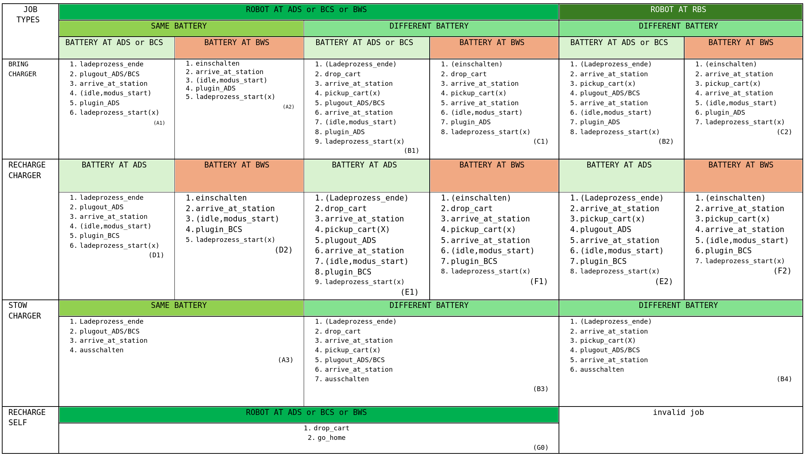
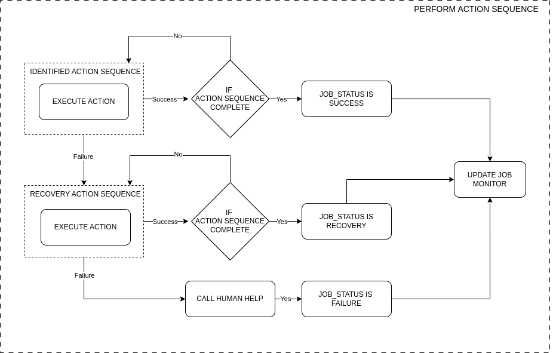

# chargepal_behaviour_tree
This package is the executor of chargepal jobs.

## Dependencies

- chargepal_actions : Performing any ros actions affiliated to the robot
- chargepal_services : Performing any ros services affiliated to the robot
- chargepal_client : Communcation medium to the grpc server

The image below shows the dependencies as a flow state

## Overview

The figure below shows the executor logic within the behaviour tree.

The robot asks the Server for a job and updates the `robot_charge` @1Hz. When a job is received, the robot sets the blackboard of the behaviour tree, which can be thought as global variables. Since a job is fetched from the server, it is assumed that there is a positive server connection at that point in time. Note that `rdb.db`table values are constantly updated with the table values of `ldb.db`. Hence, the `rdb.db` should be having the latest values when a job is fetched. 

The target components of the job, i.e. job related robot and carts are found and only those rows from` rdb.db` are set into `rdbc.db`and pushed to `ldb.db`(which should be having the same values at this point!)

The action sequence can be identified based on robot location and the job's cart/battery. The table below describes the action sequence in order of numbers for each `job_type`, based on robot's location and target battery. 

**Note**: action inside `()` means they are parallel actions. i.e. they are started and run in parallel to the next action in the sequnce. Sometimes there are many actions inside `()`, where there are run parallely in sequence to the next action in action sequence. `(x)` marking beside any action means, all parallel actions before it should be completed successfully for it to start.

When any action is being performed, values in respective tables are set in `rdbc.db` and pushed to `ldb.db`. The image below shows an overview of the process inside performing an action sequence.

For MiR based actions, MiR errors and mission queues are cleared to make sure the actions based out of MiR platform are handled properly before a new action is started. Upon successfull completion the robot communicates `Success` via `update_job_monitor` service and goes back to fetching a job from the server.

When any action fails, a set of recovery actions are performed. Upon successfull completion, the robot communicates `Recovery` via `update_job_monitor` service, and goes back to fetching a job from the server.

If any of the action inside recovery action sequence fails, a notification is sent via email, the robot communicates `Failure` via `update_job_monitor` service and the behaviour tree exits.

In all the cases, when the robot is unable to update the server by via `update_job_monitor` service until a server timeout, a notification is sent via email and the behaviour tree exits.